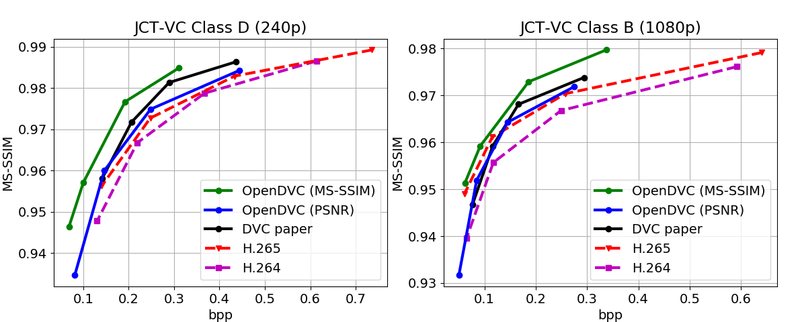

Our latest works on learned video compression:
> Yang, Ren, *et al.* "Learning for video compression with hierarchical quality and recurrent enhancement." *Proceedings of the IEEE/CVF Conference on Computer Vision and Pattern Recognition (CVPR)*. 2020.

> Yang, Ren, *et al.* "Learning for Video Compression with Recurrent Auto-Encoder and Recurrent Probability Model." *arXiv preprint arXiv:2006.13560* (2020).

# OpenDVC -- An open source implementation of Deep Video Compression (DVC)

An open source Tensorflow implementation of the paper:

> Lu, Guo, *et al.* "DVC: An end-to-end deep video compression framework." *Proceedings of the IEEE Conference on Computer Vision and Pattern Recognition (CVPR)*. 2019.

In this paper, the DVC method is only optimized for PSNR. In our OpenDVC codes, we provide the **PSNR-optimized** re-implementation, denoted as OpenDVC (PSNR), and also the **MS-SSIM-optimized** model, denoted as OpenDVC (MS-SSIM).

Contact:

Ren Yang @ ETH Zurich, Switzerland

Email: ren.yang@vision.ee.ethz.ch

## Dependency

- Tensorflow 1.12

- Tensorflow-compression 1.0 ([Download link](https://github.com/tensorflow/compression/releases/tag/v1.0))

  (*After downloading, put the folder "tensorflow_compression" to the same directory as the codes.*)

- Pre-trained models ([Download link](https://drive.google.com/drive/folders/1gUkf9FNjiZw6Pcr5U_bl3jgbM1_ZpB2K?usp=sharing))

  (*Download the folders, e.g., "PSNR_1024_model", to the same directory as the codes.*)

- BPG ([Download link](https://bellard.org/bpg/))  -- needed only for the PSNR model

  (*In our PSNR model, we use BPG to compress I-frames instead of training learned image compression models.*)

- Context-adaptive image compression model, Lee et al., ICLR 2019 ([Paper](https://arxiv.org/abs/1809.10452), [Model](https://github.com/JooyoungLeeETRI/CA_Entropy_Model)) -- needed only for the MS-SSIM model

  (*In our MS-SSIM model, we use Lee et al., ICLR 2019 to compress I-frames.*)

## How to use

We follow Lu *et al.*, DVC to feed RGB images into the deep encoder. To compress a YUV video, please first convert to PNG images with the following command.

```
ffmpeg -pix_fmt yuv420p -s WidthxHeight -i Name.yuv -vframes Frame path_to_PNG/f%03d.png
```

Note that, OpenDVC currently only supports the frames with the height and width as the multiples of 16. The original DVC method requires the multiples of 32. Therefore, when using OpenDVC, please first crop frames, e.g.,

```
ffmpeg -pix_fmt yuv420p -s 1920x1080 -i Name.yuv -vframes Frame -filter:v "crop=1920:1072:0:0" path_to_PNG/f%03d.png
```

The augments in OpenDVC encoder (OpenDVC_test_video.py) include:

```
--path, the path to PNG files;

--frame, the total frame number to compress;

--GOP, the GOP size, e.g., 10;

--mode, compress with the PSNR or MS-SSIM optimized model;

--metric, evaluate quality in terms of PSNR or MS-SSIM;

--python_path, the path to python (only used for MS-SSIM model to run Lee et al., ICLR 2019 on I-frames);

--CA_model_path, the path to CA_EntropyModel_Test of Lee et al., ICLR 2019 (only used for MS-SSIM model);

--l, lambda value. The pre-trained PSNR models are trained by 4 lambda values, i.e., 256, 512, 1024 and 2048, with increasing bit-rate/PSNR. The MS-SSIM models are trained with lambda values of 8, 16, 32 and 64, with increasing bit-rate/MS-SSIM;

--N, filter number in CNN (Do not change);

--M, channel number of latent representations (Do not change).
```

For example, the test code for OpenDVC encoder can be used as follows.
```
python OpenDVC_test_video.py --path BasketballPass --model PSNR  --metric PSNR --l 1024
```
```
python OpenDVC_test_video.py --path BasketballPass --model MS-SSIM  --metric MS-SSIM --python python --CA_model_path ./CA_EntropyModel_Test --l 32
```
The OpenDVC encoder generates the encoded bit-stream and compressed frames in two folders.
```
path = args.path + '/' # path to PNG
path_com = args.path + '_com_' + args.mode  + '_' + str(args.l) + '/' # path to compressed frames
path_bin = args.path + '_bin_' + args.mode  + '_' + str(args.l) + '/' # path to encoded bit-streams
```

## To do

Release the codes of decoder.

## Performance

As shown in the figures below, our **OpenDVC (PSNR)** model achieves comparable PSNR performance with the reported results in Lu *et al.*, DVC (PSNR optimized), and our **OpenDVC (MS-SSIM)** model obviously outperforms DVC in terms of MS-SSIM.


